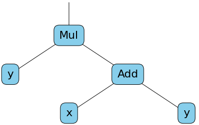
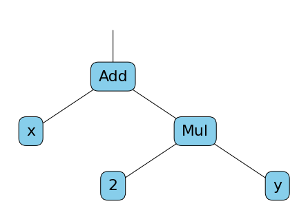

## 自动微分

[Understanding Automatic Differentiation in 30 lines of Python](https://vmartin.fr/understanding-automatic-differentiation-in-30-lines-of-python.html)

```python
import numpy as np
from collections import namedtuple

Children = namedtuple('Children', ['a', 'b', 'op'])

class Tensor:
    def __init__(self, value=None, children=None):
        self.value = value
        self.children = children

    def forward(self):
        if self.children is None:
            return self

        # compute forward pass of children in the tree
        a = self.children.a.forward()
        b = self.children.b.forward()

        # If values are set, let's compute the real value of this tensor
        if a.value is not None and b.value is not None:
            self.value = self.children.op(a.value, b.value)
        return self

    def __repr__(self):
        return f"T:{self.value}"

    def __add__(self, other):
        c = Children(self, other, np.add)
        t = Tensor(children=c)
        return t.forward()

    def __mul__(self, other):
        c = Children(self, other, np.multiply)
        t = Tensor(children=c)
        return t.forward()

    def grad(self, deriv_to):
        # 给定一个标量 s（它不是任何其他张量的函数）和另一个张量 t ，标量 s 相对于 t 的导数是 0。这是因为 s 不依赖于 t 的值，所以改变 t 的值不会对 s 产生任何影响。这就是为什么在 `grad` 函数中，如果一个 `Tensor` 对象没有子节点（即它是一个基本值或标量），那么它相对于任何其他 `Tensor` 对象的导数就是 0
        if self is deriv_to:
            return Tensor(1)

        if self.children is None:
            return Tensor(0)

        if self.children.op is np.add: # (a + b)' = a' + b'
            t = self.children.a.grad(deriv_to) + self.children.b.grad(deriv_to)
        elif self.children.op is np.multiply: # (ab)' = a'b + ab'
            t = self.children.a.grad(deriv_to) * self.children.b + \
                self.children.a * self.children.b.grad(deriv_to)
        else:
            raise NotImplementedError(f"This op is not implemented. {self.children.op}")

        return t
```

#### 前向计算图（Forward Computation Graph）
```python
x = Tensor(3)
y = Tensor(5)

z1 = x + y
z2 = z1 * y
print(x, y)
print(z2)

# Out
# T:3 T:5
# T:40
```


#### 梯度计算图（Gradient Computation Graph）
```python
print(x, y)
g = z2.grad(y)
print(g)

# Out
# T:3 T:5
# T:13
```


1. 创建一个能包含`value`值和二叉树结构`children`的 `Tensor` 类，这使得每个张量都可以包含其他两个张量以及生成它的操作
2. 这里的计算图仅包含每个 `Tensor`对象中的部分`value`（叶节点）和`children`（中间节点）信息
3. 每调用一次算子都会构造出就算图的一部分，递归调用构造出整张*前向计算图*
4. 由于`grad`函数内部也递归调用了算子，所以其实际上返回了一张新的*梯度计算图*